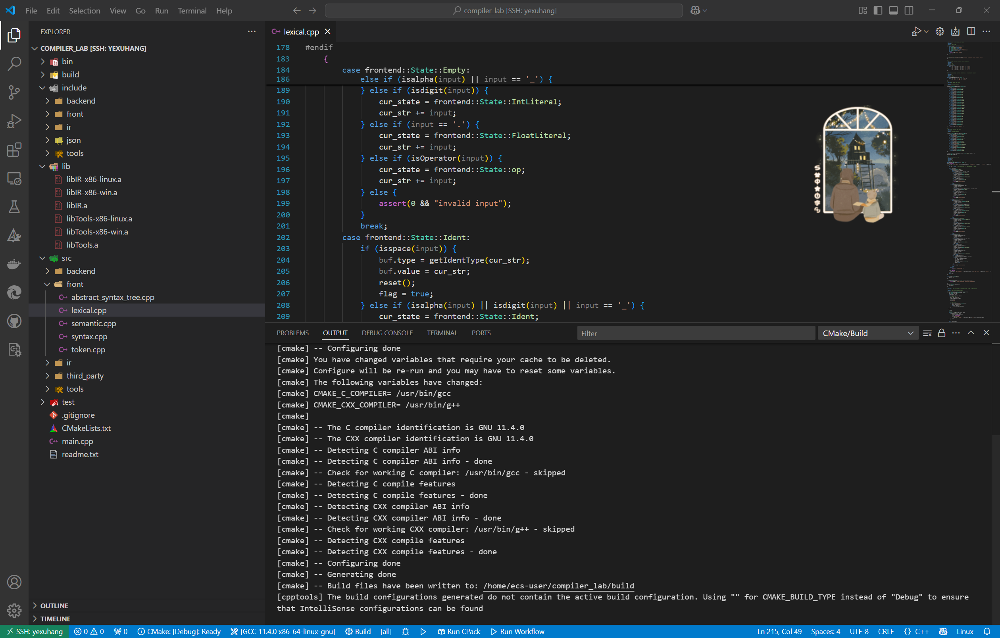

# 编译原理实验整体说明

## 一、关于实验环境的配置

本人很喜欢使用云服务器，故选择使用**阿里云服务器**进行实验，而没有选择 WSL 以及虚拟机。

此外，本人没有选择使用 Docker，因为在连接 VSCode 时，发现该实验提供的镜像中一些软件版本过低而导致连接不上（这个镜像23年创建后就没有再更新维护了），而且在云服务器上配置可供实验进行的环境并不复杂（只需要按照教程安装需要的软件即可），故放弃使用 Docker。

所以我配置环境的一般步骤是：购买云服务器 \(\rightarrow\) 安装如gcc，g++，cmake等软件 \(\rightarrow\) VSCode 连接云服务器 \(\rightarrow\) 在 VSCode 上像本机一样愉快地编码
> 如果你之前有过云服务器使用经验，这些步骤就不需要费很多精力，体验感也拉满！

## 二、关于代码框架的选择

首先要明确一点是，我们要做的其实是一个完整的大的项目：手搓一个编译器。而我们的四次实验其实是把整个过程拆分成了四个子部分：词法和语法分析、语义分析和中间代码生成、以及目标代码生成。故**每个部分都依赖前一个部分的结果**，逐步构建一个完整编译器。

我们希冀上其实一共提供了三个版本的实验框架，而实验1和实验2的框架都只包含自己实验需要的部分，不包括后面的内容。故我选择直接使用实验3的代码框架，这样可以一直延续使用，不用中途更换代码，而且看起来更像是一个完整的大型项目。

